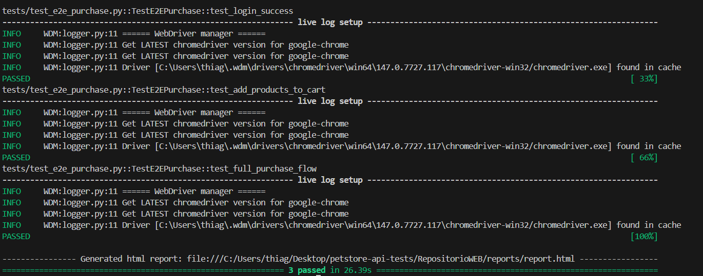
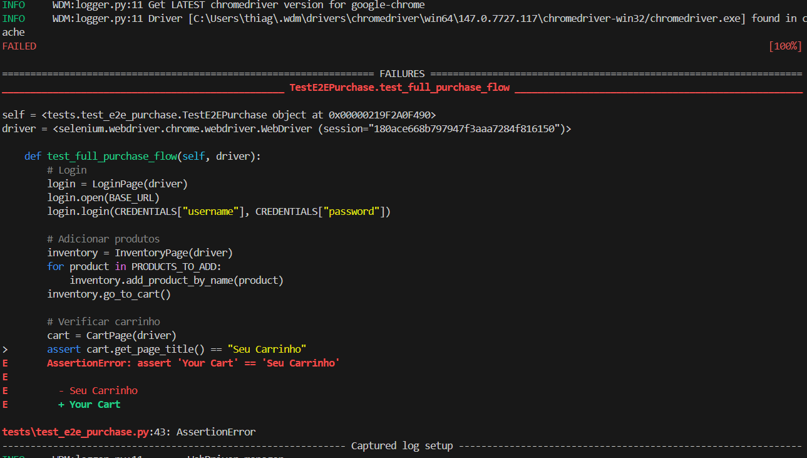

# Projeto de Automação de Testes

Projeto de avaliação técnica composto por duas automações distintas: testes de API REST e testes Web E2E, ambos desenvolvidos em Python seguindo boas práticas de qualidade de software.

**Aluno:** Thiago Emanuel  
**Professor(a):** Lia ##não esquecer de pesquisar sobrenome##

---

## Índice

- [Parte 1 — Automação de API (Petstore)](#parte-1--automação-de-api-petstore)
  - [Tecnologias — API](#tecnologias--api)
  - [Estrutura — API](#estrutura--api)
  - [Instalação — API](#instalação--api)
  - [Como Executar — API](#como-executar--api)
  - [Cobertura de Testes — API](#cobertura-de-testes--api)
  - [Relatório HTML — API](#relatório-html--api)
  - [CI/CD — API](#cicd--api)
  - [Design Patterns — API](#design-patterns--api)
- [Parte 2 — Automação Web (SauceDemo)](#parte-2--automação-web-saucedemo)
  - [Tecnologias — Web](#tecnologias--web)
  - [Estrutura — Web](#estrutura--web)
  - [Instalação — Web](#instalação--web)
  - [Como Executar — Web](#como-executar--web)
  - [Cobertura de Testes — Web](#cobertura-de-testes--web)
  - [Relatório HTML — Web](#relatório-html--web)
  - [CI/CD — Web](#cicd--web)
  - [Design Patterns — Web](#design-patterns--web)

---

---

# Parte 1 — Automação de API (Petstore)

Automação dos principais endpoints da API pública [Swagger Petstore](https://petstore.swagger.io/v2), cobrindo os módulos **Pet**, **Store** e **User** com cenários positivos e negativos.

**Base URL:** `https://petstore.swagger.io/v2`

---

## Tecnologias — API

| Tecnologia | Finalidade |
|---|---|
| Python 3.11+ | Linguagem principal |
| Pytest | Framework de testes |
| Requests | Cliente HTTP |
| Faker | Geração de dados dinâmicos |
| pytest-html | Geração de relatório HTML |
| GitHub Actions | Pipeline de CI/CD |

---

## Estrutura — API

```
RepositorioAPI/
├── tests/
│   ├── conftest.py             # Fixtures globais e compartilhadas
│   ├── test_pet.py             # Testes do módulo Pet
│   ├── test_store.py           # Testes do módulo Store
│   └── test_user.py            # Testes do módulo User
├── services/
│   ├── base_service.py         # Classe base com métodos HTTP reutilizáveis
│   ├── pet_service.py          # Serviço de Pet
│   ├── store_service.py        # Serviço de Store
│   └── user_service.py         # Serviço de User
├── models/
│   ├── pet_model.py            # Payload de Pet
│   ├── store_model.py          # Payload de Store
│   └── user_model.py           # Payload de User
├── utils/
│   └── helpers.py              # Funções utilitárias e geração de dados
├── reports/                    # Relatório HTML gerado após execução
├── conftest.py                 # Configuração de path (raiz)
├── pytest.ini                  # Configuração do Pytest
└── requirements.txt            # Dependências do projeto
```

---

## Instalação — API

**1. Clone o repositório**

```bash
git clone https://github.com/SEU_USUARIO/SEU_REPOSITORIO.git
cd RepositorioAPI
```

**2. Crie e ative o ambiente virtual**

Linux/macOS:
```bash
python -m venv venv
source venv/bin/activate
```

Windows (PowerShell):
```powershell
python -m venv venv
venv\Scripts\Activate.ps1
```

> Se aparecer erro de permissão no Windows, execute antes:
> ```powershell
> Set-ExecutionPolicy -ExecutionPolicy RemoteSigned -Scope CurrentUser
> ```

**3. Instale as dependências**

```bash
pip install -r requirements.txt
```

---

## Como Executar — API

Rodar todos os testes:
```bash
pytest -v
```

Rodar testes de um módulo específico:
```bash
pytest tests/test_pet.py -v
pytest tests/test_store.py -v
pytest tests/test_user.py -v
```

Rodar um teste específico pelo nome:
```bash
pytest -k "test_create_pet" -v
```

Abrir o relatório HTML após a execução:

Windows:
```powershell
start reports\report.html
```

Linux/macOS:
```bash
open reports/report.html
```

---

## Cobertura de Testes — API

### Pet — `test_pet.py`

| Teste | Descrição | Tipo |
|---|---|---|
| `test_create_pet_success` | Cria um pet e valida o retorno | Positivo |
| `test_get_pet_by_id` | Busca pet por ID existente | Positivo |
| `test_update_pet` | Atualiza nome e status do pet | Positivo |
| `test_find_pets_by_status_available` | Lista pets com status `available` | Positivo |
| `test_find_pets_by_status_sold` | Lista pets com status `sold` | Positivo |
| `test_delete_pet` | Remove um pet existente | Positivo |
| `test_get_deleted_pet_returns_404` | Busca pet removido e espera 404 | Negativo |

### Store — `test_store.py`

| Teste | Descrição | Tipo |
|---|---|---|
| `test_get_inventory` | Consulta o inventário da loja | Positivo |
| `test_place_order` | Realiza um pedido de compra | Positivo |
| `test_get_order_by_id` | Busca pedido por ID | Positivo |
| `test_delete_order` | Cancela um pedido existente | Positivo |
| `test_get_deleted_order_returns_404` | Busca pedido removido e espera 404 | Negativo |

### User — `test_user.py`

| Teste | Descrição | Tipo |
|---|---|---|
| `test_create_user` | Cria um novo usuário | Positivo |
| `test_get_user` | Busca usuário por username | Positivo |
| `test_login` | Realiza login com credenciais válidas | Positivo |
| `test_update_user` | Atualiza dados do usuário | Positivo |
| `test_logout` | Realiza logout da sessão | Positivo |
| `test_delete_user` | Remove usuário existente | Positivo |
| `test_get_deleted_user_returns_404` | Busca usuário removido e espera 404 | Negativo |

**Total: 19 testes — todos passando.**

---

## Relatório HTML — API

O relatório é gerado automaticamente em `reports/report.html` após cada execução. Ele exibe o resultado de cada teste, tempo de execução e logs das requisições.


---

## CI/CD — API

A pipeline é acionada automaticamente a cada `push` ou `pull request` na branch `main`. As etapas executadas são:

1. Checkout do código
2. Configuração do Python 3.11
3. Instalação das dependências
4. Execução dos testes com Pytest
5. Upload do relatório HTML como artefato da pipeline

```yaml
name: API Tests - Petstore

on:
  push:
    branches: [main]
  pull_request:
    branches: [main]

jobs:
  api-tests:
    runs-on: ubuntu-latest
    steps:
      - uses: actions/checkout@v4
      - uses: actions/setup-python@v5
        with:
          python-version: "3.11"
      - run: pip install -r RepositorioAPI/requirements.txt
      - run: cd RepositorioAPI && pytest
      - uses: actions/upload-artifact@v4
        if: always()
        with:
          name: api-test-report
          path: RepositorioAPI/reports/report.html
```

---

## Design Patterns — API

**Service Layer**
Toda a comunicação HTTP está encapsulada nas classes de serviço (`PetService`, `StoreService`, `UserService`), que herdam de uma `BaseService` comum. Isso separa a lógica de requisição dos testes, tornando o código mais reutilizável e fácil de manter.

**Fixture Pattern (Pytest)**
As fixtures no `conftest.py` gerenciam o ciclo de vida dos dados de teste — criação de pet, pedido e usuário — evitando duplicação de código e garantindo isolamento entre os cenários.

**Model/Payload Pattern**
Os payloads das requisições são centralizados na pasta `models/`, com dados gerados dinamicamente via `Faker` e `random`, evitando conflitos entre execuções consecutivas.

---

---

# Parte 2 — Automação Web (SauceDemo)

Automação de um fluxo funcional ponta a ponta (E2E) no site [SauceDemo](https://www.saucedemo.com/), cobrindo login, adição de produtos ao carrinho e finalização de compra, utilizando Selenium com Python e o padrão Page Object Model.

**URL:** `https://www.saucedemo.com/`

---

## Tecnologias — Web

| Tecnologia | Finalidade |
|---|---|
| Python 3.11+ | Linguagem principal |
| Selenium | Automação do navegador |
| WebDriver Manager | Gerenciamento automático do ChromeDriver |
| Pytest | Framework de testes |
| pytest-html | Geração de relatório HTML |
| GitHub Actions | Pipeline de CI/CD |

---

## Estrutura — Web

```
RepositorioWeb/
├── pages/
│   ├── base_page.py            # Classe base com métodos de interação reutilizáveis
│   ├── login_page.py           # Page Object da página de login
│   ├── inventory_page.py       # Page Object da página de produtos
│   ├── cart_page.py            # Page Object da página do carrinho
│   └── checkout_page.py        # Page Object das etapas de checkout
├── tests/
│   ├── conftest.py             # Fixture do driver e configuração do Selenium
│   └── test_e2e_purchase.py    # Testes E2E do fluxo completo de compra
├── utils/
│   └── helpers.py              # Constantes e dados utilizados nos testes
├── reports/                    # Relatório HTML gerado após execução
├── pytest.ini                  # Configuração do Pytest
└── requirements.txt            # Dependências do projeto
```

---

## Instalação — Web

**1. Navegue até a pasta do projeto web**

```bash
cd RepositorioWeb
```

**2. Com o ambiente virtual já ativo (criado na Parte 1), instale as dependências**

```bash
pip install -r requirements.txt
```

> O ChromeDriver é gerenciado automaticamente pelo `webdriver-manager`, não é necessário instalar manualmente.

---

## Como Executar — Web

Rodar todos os testes:
```bash
pytest -v
```

Rodar um teste específico pelo nome:
```bash
pytest -k "test_full_purchase_flow" -v
```

Abrir o relatório HTML após a execução:

Windows:
```powershell
start reports\report.html
```

Linux/macOS:
```bash
open reports/report.html
```

---

## Cobertura de Testes — Web

### Fluxo E2E — `test_e2e_purchase.py`

| Teste | Descrição | Tipo |
|---|---|---|
| `test_login_success` | Realiza login com credenciais válidas e valida redirecionamento | Positivo |
| `test_add_products_to_cart` | Adiciona produtos ao carrinho e valida o contador | Positivo |
| `test_full_purchase_flow` | Fluxo completo: login, carrinho, checkout e confirmação de compra | Positivo |

**Total: 3 testes — todos passando.**

---

## Relatório HTML — Web

O relatório é gerado automaticamente em `reports/report.html` após cada execução.

### Execução com sucesso



### Exemplo de falha intencional

Durante o desenvolvimento, um dos testes falhou porque a asserção estava escrita em português no código enquanto a aplicação retorna a mensagem em inglês. O print abaixo registra essa ocorrência:



---

## CI/CD — Web

A pipeline roda os testes do Selenium em modo headless (sem interface gráfica), pois o ambiente do GitHub Actions não possui tela. As etapas executadas são:

1. Checkout do código
2. Configuração do Python 3.11
3. Instalação das dependências
4. Instalação do Chrome
5. Execução dos testes em modo headless
6. Upload do relatório HTML como artefato da pipeline

```yaml
  web-tests:
    runs-on: ubuntu-latest

    steps:
      - name: Checkout código
        uses: actions/checkout@v4

      - name: Configurar Python
        uses: actions/setup-python@v5
        with:
          python-version: "3.11"

      - name: Instalar dependências
        run: pip install -r RepositorioWeb/requirements.txt

      - name: Instalar Chrome
        uses: browser-actions/setup-chrome@v1

      - name: Executar testes Web
        run: |
          cd RepositorioWeb
          pytest

      - name: Publicar relatório HTML
        uses: actions/upload-artifact@v4
        if: always()
        with:
          name: web-test-report
          path: RepositorioWeb/reports/report.html
```

---

## Design Patterns — Web

**Page Object Model (POM)**
Cada página da aplicação é representada por uma classe Python na pasta `pages/`. Isso isola os localizadores de elementos e as ações de cada tela, evitando duplicação e facilitando a manutenção quando a interface muda.

**Base Page**
A classe `BasePage` centraliza os métodos de interação com o Selenium — como `find`, `click`, `type` e `is_visible` — com esperas explícitas já embutidas. Todas as páginas herdam dessa classe, garantindo consistência e eliminando código repetido.

**Fixture Pattern (Pytest)**
A fixture `driver` no `conftest.py` inicializa e encerra o navegador automaticamente para cada teste, garantindo isolamento completo entre os cenários e evitando interferência de estado entre execuções.