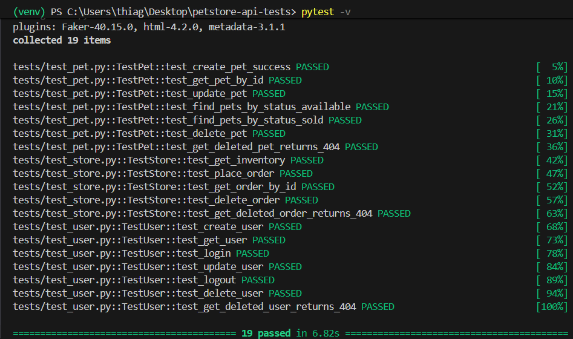

# Petstore API Test Automation

Projeto de automação de testes para a API pública [Swagger Petstore](https://petstore.swagger.io/v2), desenvolvido com Python e Pytest, seguindo boas práticas de organização de código e qualidade de software.

**Base URL:** `https://petstore.swagger.io/v2`

---

## Índice

- [Tecnologias Utilizadas](#tecnologias-utilizadas)
- [Estrutura do Projeto](#estrutura-do-projeto)
- [Pré-requisitos](#pré-requisitos)
- [Instalação](#instalação)
- [Como Executar](#como-executar)
- [Cobertura de Testes](#cobertura-de-testes)
- [Relatório HTML](#relatório-html)
- [CI/CD com GitHub Actions](#cicd-com-github-actions)
- [Design Patterns Utilizados](#design-patterns-utilizados)

---

## Tecnologias Utilizadas

| Tecnologia | Finalidade |
|---|---|
| Python 3.11+ | Linguagem principal |
| Pytest | Framework de testes |
| Requests | Cliente HTTP |
| Faker | Geração de dados dinâmicos |
| pytest-html | Geração de relatório HTML |
| GitHub Actions | Pipeline de CI/CD |

---

## Estrutura do Projeto

```
petstore-api-tests/
├── .github/
│   └── workflows/
│       └── ci.yml              # Pipeline do GitHub Actions
├── tests/
│   ├── conftest.py             # Fixtures globais e compartilhadas
│   ├── test_pet.py             # Testes do módulo Pet
│   ├── test_store.py           # Testes do módulo Store
│   └── test_user.py            # Testes do módulo User
├── services/
│   ├── base_service.py         # Classe base com métodos HTTP reutilizáveis
│   ├── pet_service.py          # Serviço de Pet
│   ├── store_service.py        # Serviço de Store
│   └── user_service.py         # Serviço de User
├── models/
│   ├── pet_model.py            # Payload de Pet
│   ├── store_model.py          # Payload de Store
│   └── user_model.py           # Payload de User
├── utils/
│   └── helpers.py              # Funções utilitárias e geração de dados
├── reports/                    # Relatório HTML gerado após execução
├── conftest.py                 # Configuração de path (raiz)
├── pytest.ini                  # Configuração do Pytest
├── requirements.txt            # Dependências do projeto
└── README.md
```

---

## Pré-requisitos

- Python 3.11 ou superior
- Git
- Conexão com a internet (a API é pública)

---

## Instalação

**1. Clone o repositório**

```bash
git clone https://github.com/SEU_USUARIO/petstore-api-tests.git
cd petstore-api-tests
```

**2. Crie e ative o ambiente virtual**

Linux/macOS:
```bash
python -m venv venv
source venv/bin/activate
```

Windows (PowerShell):
```powershell
python -m venv venv
venv\Scripts\Activate.ps1
```

> Se aparecer erro de permissão no Windows, execute antes:
> ```powershell
> Set-ExecutionPolicy -ExecutionPolicy RemoteSigned -Scope CurrentUser
> ```

**3. Instale as dependências**

```bash
pip install -r requirements.txt
```

---

## Como Executar

Rodar todos os testes:
```bash
pytest -v
```

Rodar testes de um módulo específico:
```bash
pytest tests/test_pet.py -v
pytest tests/test_store.py -v
pytest tests/test_user.py -v
```

Rodar um teste específico pelo nome:
```bash
pytest -k "test_create_pet" -v
```

Abrir o relatório HTML após a execução:

Windows:
```powershell
start reports\report.html
```

Linux/macOS:
```bash
open reports/report.html
```

---

## Cobertura de Testes

### Pet — `test_pet.py`

| Teste | Descrição | Tipo |
|---|---|---|
| `test_create_pet_success` | Cria um pet e valida o retorno | Positivo |
| `test_get_pet_by_id` | Busca pet por ID existente | Positivo |
| `test_update_pet` | Atualiza nome e status do pet | Positivo |
| `test_find_pets_by_status_available` | Lista pets com status `available` | Positivo |
| `test_find_pets_by_status_sold` | Lista pets com status `sold` | Positivo |
| `test_delete_pet` | Remove um pet existente | Positivo |
| `test_get_deleted_pet_returns_404` | Busca pet removido e espera 404 | Negativo |

### Store — `test_store.py`

| Teste | Descrição | Tipo |
|---|---|---|
| `test_get_inventory` | Consulta o inventário da loja | Positivo |
| `test_place_order` | Realiza um pedido de compra | Positivo |
| `test_get_order_by_id` | Busca pedido por ID | Positivo |
| `test_delete_order` | Cancela um pedido existente | Positivo |
| `test_get_deleted_order_returns_404` | Busca pedido removido e espera 404 | Negativo |

### User — `test_user.py`

| Teste | Descrição | Tipo |
|---|---|---|
| `test_create_user` | Cria um novo usuário | Positivo |
| `test_get_user` | Busca usuário por username | Positivo |
| `test_login` | Realiza login com credenciais válidas | Positivo |
| `test_update_user` | Atualiza dados do usuário | Positivo |
| `test_logout` | Realiza logout da sessão | Positivo |
| `test_delete_user` | Remove usuário existente | Positivo |
| `test_get_deleted_user_returns_404` | Busca usuário removido e espera 404 | Negativo |

**Total: 19 testes — todos passando.**

---

## Relatório HTML

O relatório é gerado automaticamente em `reports/report.html` após cada execução. Ele exibe o resultado de cada teste, tempo de execução e logs das requisições.



---

## CI/CD com GitHub Actions

A pipeline é acionada automaticamente a cada `push` ou `pull request` na branch `main`. As etapas executadas são:

1. Checkout do código
2. Configuração do Python 3.11
3. Instalação das dependências
4. Execução dos testes com Pytest
5. Upload do relatório HTML como artefato da pipeline

Arquivo de configuração em `.github/workflows/ci.yml`:

```yaml
name: API Tests - Petstore

on:
  push:
    branches: [main]
  pull_request:
    branches: [main]

jobs:
  api-tests:
    runs-on: ubuntu-latest
    steps:
      - uses: actions/checkout@v4
      - uses: actions/setup-python@v5
        with:
          python-version: "3.11"
      - run: pip install -r requirements.txt
      - run: pytest
      - uses: actions/upload-artifact@v4
        if: always()
        with:
          name: test-report
          path: reports/report.html
```

O relatório HTML fica disponível como artefato na aba **Actions** do repositório após cada execução.

---

## Design Patterns Utilizados

**Service Layer**
Toda a comunicação HTTP está encapsulada nas classes de serviço (`PetService`, `StoreService`, `UserService`), que herdam de uma `BaseService` comum. Isso separa a lógica de requisição dos testes, tornando o código mais reutilizável e fácil de manter.

**Fixture Pattern (Pytest)**
As fixtures no `conftest.py` gerenciam o ciclo de vida dos dados de teste — criação de pet, pedido e usuário — evitando duplicação de código e garantindo isolamento entre os cenários.

**Model/Payload Pattern**
Os payloads das requisições são centralizados na pasta `models/`, com dados gerados dinamicamente via `Faker` e `random`, evitando conflitos entre execuções consecutivas.

---

## Autor

Desenvolvido como parte de um projeto de avaliação técnica em automação de testes de software.
Aluno: Thiago Emanuel
Professor(a): Lia ##nao esquecer de pesquisar sobrenome##